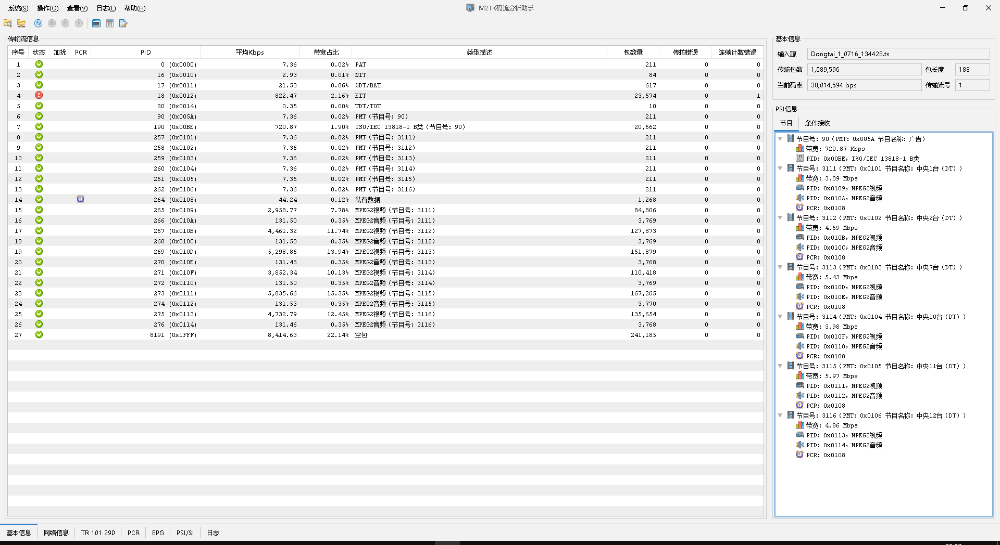
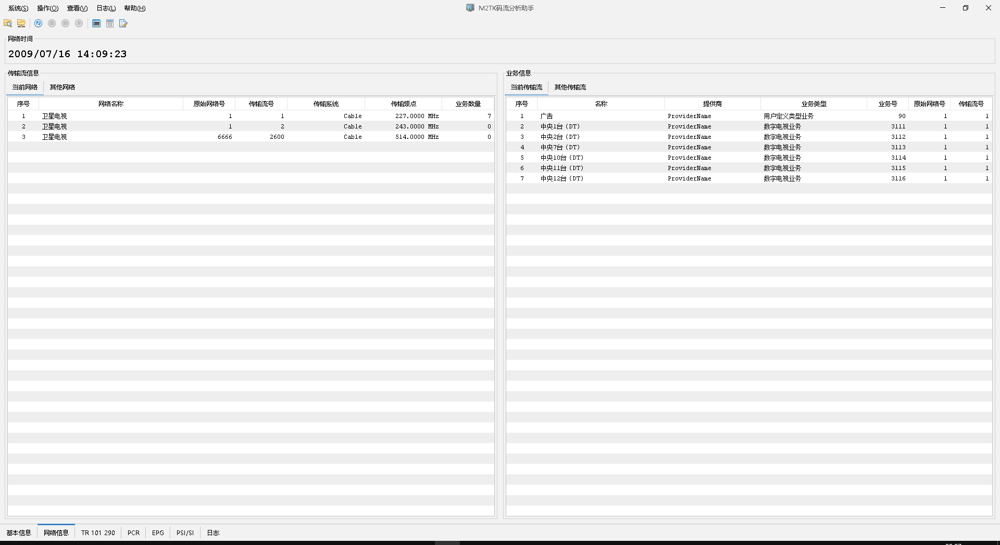
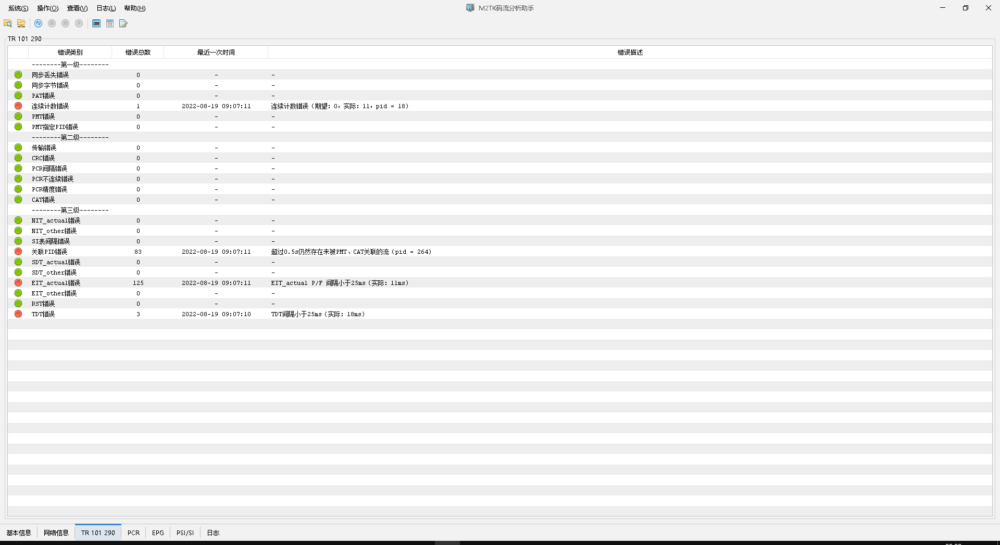
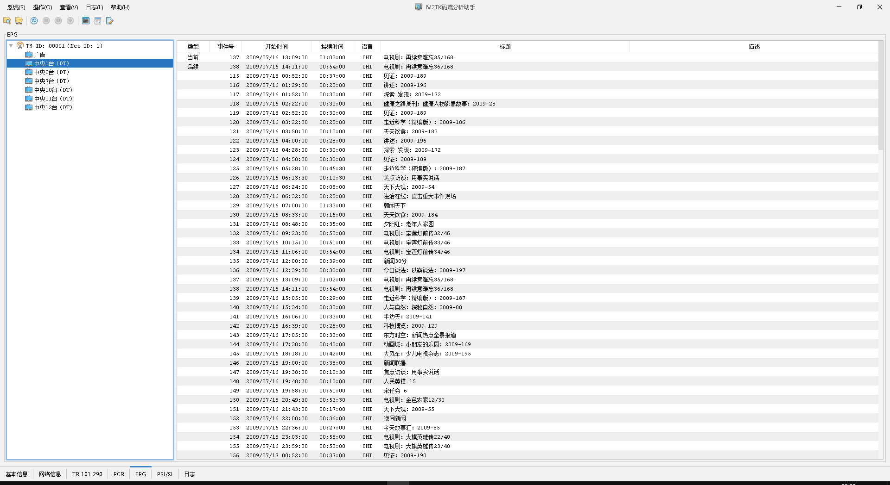
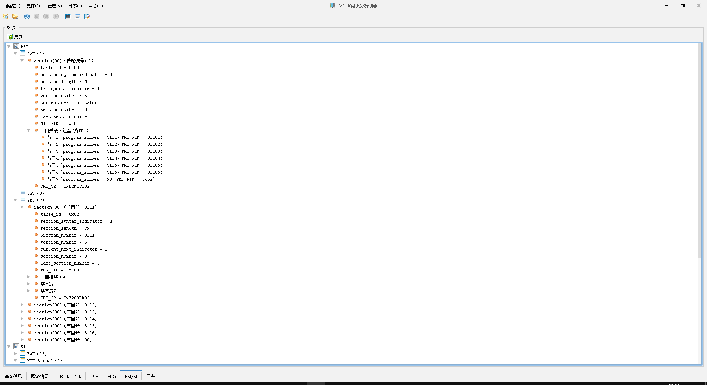

# m2tk-assistant

#### 介绍
传输流分析工具，支持静态文件分析和UDP组播流实时分析。支持TR 101.290故障检测，PSI/SI语法分析，SI解析，EPG解析，PCR统计。

#### 软件架构
1.  GUI：Java Swing
2.  底层：m2tk-core + m2tk-multiplex + m2tk-io

#### 安装教程

1.  安装Java 1.8+环境（JRE或JDK，任意）
2.  安装maven
3.  下载源代码，maven clean package，target目录里生成m2tk-assistant-{version}.zip。
4.  解压zip，双击exe启动程序。

#### 待完善

1.  实现对更多的PSI/SI描述符进行解析和语法呈现（目前仅实现了几个常用的描述符）。
2.  支持用户自定义结构解析与语法呈现（通用解析模型）
3.  支持指定流数据过滤
4.  结果导出和报表
5.  播放清流节目
6.  对PES结构的解析和呈现，对视频质量进行评估

#### 运行界面

流基本信息

网络结构分析

TR290分析

EPG解析

PSI/SI表结构
