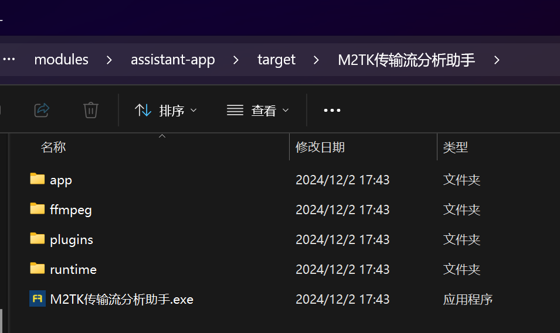
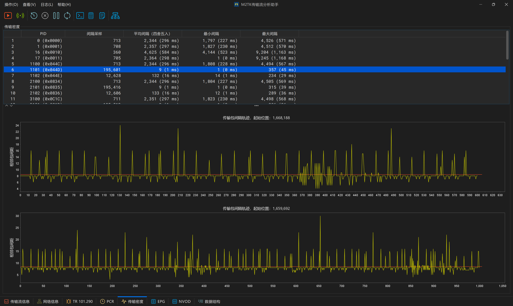

# m2tk-assistant

#### 介绍
传输流分析工具，支持静态文件分析和UDP组播流实时分析。支持TR 101.290故障检测，PSI/SI语法分析，SI解析，EPG解析，PCR统计。


#### 软件架构
1. GUI：Java Swing
2. 模块化：pf4j
3. 解复用：m2tk-core + m2tk-multiplex + m2tk-io
4. 音视频解码：ffmpeg（借助 [Jaffree](https://github.com/kokorin/Jaffree/) 调用本地ffmpeg程序）


#### 安装教程

1. 安装JDK 13+
2. 安装maven
3. 下载项目源代码，在项目主目录下执行`mvn clean package`，modules/assistant-app/target目录里将生成可移动的运行时环境（含JRE），目录结构如下：




#### 自定义Syntax解析模板（1.7+可用）

用户可以自定义Section/Descriptor语法解析模板，并在PSI/SI表视图中查看数据解析结果。
模板的具体写法可以参考 ***doc/template-guide.md*** 文档。

```xml
<?xml version = "1.0" encoding = "UTF-8"?>
<M2TKTemplate>
    <!-- 自定义解析模板示例 -->
    <TableTemplate name="program_association_section" group="PSI/PAT">
        <TableId id="0x00">
            <DisplayName str="节目关联表 (PAT)"/>
        </TableId>
        <TableBody>
            <Field name="table_id" length="8" encoding="uimsbf"/>
            <Field name="section_syntax_indicator" length="1" encoding="bslbf"/>
            <Field name="0" length="1" encoding="bslbf"/>
            <Field name="reserved" length="2" encoding="bslbf"/>
            <Field name="section_length" length="12" encoding="uimsbf">
                <FieldPresentation>
                    <Prefix str="段长度"/>
                </FieldPresentation>
            </Field>
            <Field name="transport_stream_id" length="16" encoding="uimsbf">
                <FieldPresentation>
                    <Prefix str="传输流号"/>
                </FieldPresentation>
            </Field>
            <Field name="reserved" length="2" encoding="bslbf"/>
            <Field name="version_number" length="5" encoding="bslbf">
                <FieldPresentation>
                    <Prefix str="版本号"/>
                    <Format str="%d"/>
                </FieldPresentation>
            </Field>
            <Field name="current_next_indicator" length="1" encoding="bslbf"/>
            <Field name="section_number" length="8" encoding="uimsbf">
                <FieldPresentation>
                    <Prefix str="当前分段号"/>
                </FieldPresentation>
            </Field>
            <Field name="last_section_number" length="8" encoding="uimsbf">
                <FieldPresentation>
                    <Prefix str="最后分段号"/>
                </FieldPresentation>
            </Field>
            <Loop name="program_association_loop" length_field="implicit" length_correction="-4">
                <LoopPresentation>
                    <LoopHeader str="节目关联描述"/>
                    <LoopEmpty str="***无节目关联描述***"/>
                    <LoopEntry>
                        <Prefix str="节目关联"/>
                    </LoopEntry>
                </LoopPresentation>
                <Body>
                    <Field name="program_number" length="16" encoding="uimsbf">
                        <FieldPresentation>
                            <Prefix str="节目号"/>
                        </FieldPresentation>
                    </Field>
                    <Field name="reserved" length="3" encoding="bslbf"/>
                    <If>
                        <Condition>
                            <CompareWithConst field="program_number" comp_op="equals" const="0"/>
                        </Condition>
                        <Then>
                            <Field name="network_pid" length="13" encoding="uimsbf">
                                <FieldPresentation>
                                    <Prefix str="NIT位置"/>
                                    <Format str="pid = 0x%04X (%d)"/>
                                </FieldPresentation>
                            </Field>
                        </Then>
                        <Else>
                            <Field name="program_map_pid" length="13" encoding="uimsbf">
                                <FieldPresentation>
                                    <Prefix str="PMT位置"/>
                                    <Format str="pid = 0x%04X (%d)"/>
                                </FieldPresentation>
                            </Field>
                        </Else>
                    </If>
                </Body>
            </Loop>
            <Field name="CRC_32" length="32" encoding="checksum">
                <FieldPresentation>
                    <Format str="%08X"/>
                </FieldPresentation>
            </Field>
        </TableBody>
        <UniqueKey>
            <FieldRef field="table_id"/>
            <FieldRef field="transport_stream_id"/>
            <FieldRef field="version_number"/>
            <FieldRef field="section_number"/>
        </UniqueKey>
    </TableTemplate>
</M2TKTemplate>
```

#### 2.0版本主要变化

1. 模块化（基于pf4j的插件系统），支持动态插件扩展。
2. 增加流密度展视。
3. UI更新（采用暗色主题，矢量图标）。
4. 错误修复。


#### 运行界面

流基本信息


网络结构分析


TR290分析


PCR分析


传输密度分析


EPG解析


PSI/SI表结构


根据SI信息绘制网络结构图


播放未加扰节目

