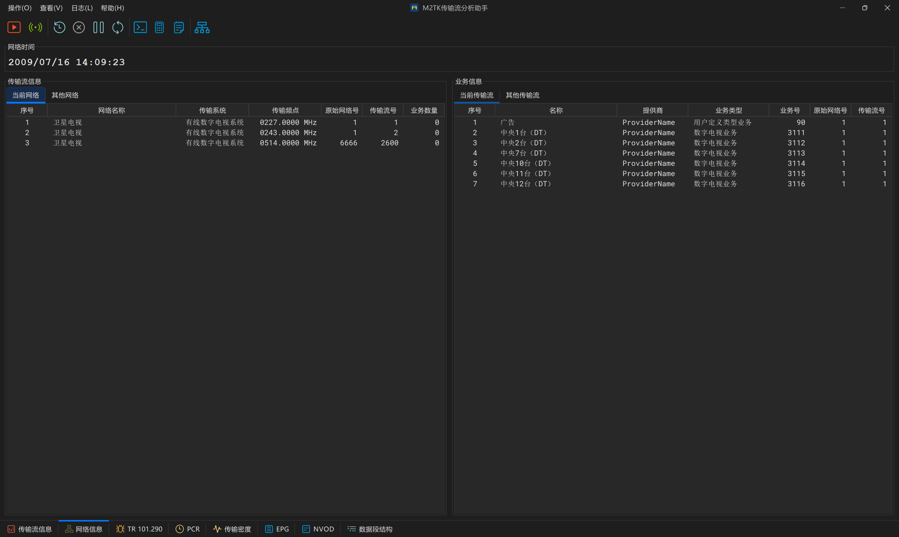
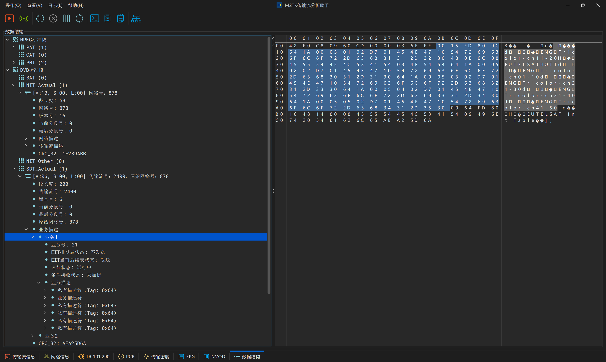
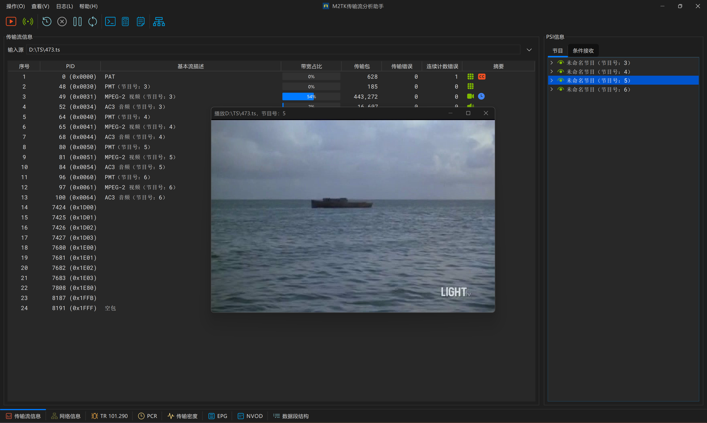

# m2tk-assistant

#### 介绍
传输流分析工具，支持静态文件分析和UDP组播流实时分析。支持TR 101.290故障检测，PSI/SI语法分析，SI解析，EPG解析，PCR统计。

#### 软件架构
1.  GUI：Java Swing
2.  解复用：m2tk-core + m2tk-multiplex + m2tk-io
3.  音视频解码：ffmpeg（基于JavaCPP封装的ffmpeg依赖）

#### 安装教程

1.  安装JDK 8+
2.  安装maven
3.  下载源代码，执行build.bat脚本，target目录里生成m2tk-assistant-{version}.zip。
4.  解压zip，双击exe启动程序。运行时可以将Java环境（64位）拷贝到m2tk-assistant目录下（命名为java），则程序将引用java目录里的运行时环境。目录结构如下：

#### 待完善

1.  ~~支持用户自定义结构解析与语法呈现（通用解析模型）~~ ☑️
2.  ~~支持指定流数据过滤~~ ☑️
3.  结果导出和报表
4.  对PES结构的解析和呈现，对视频质量进行评估

#### 运行界面

流基本信息

网络结构分析

TR290分析

PCR分析

EPG解析

PSI/SI表结构

根据SI信息绘制网络结构图

播放未加扰节目

